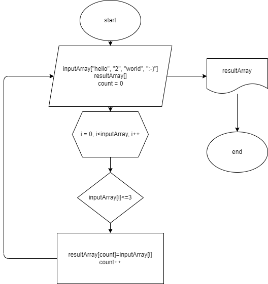

# ControlWork
# Программа для итоговой проверочной работы
### **Задача**: 
Написать программу которая, из имеющегося массива строк формирует массив из строк, длинна которых меньше либо равна 3 символа. Первоначальный массив можно ввести с клавиатуры, либо задать на старте выполнения алгоритма.

### **Для полноценного выполнения итоговой проверочной работы я:**
1. Создала репозиторий на GitHub
2. Нарисовала блок-схему алгоритма
3. Снабдила репозиторий оформленным текстовым описанием решения(README.md)
4. Использовала контроль версий(git)

### Блок-схема:

### **Описание алгоритма решения :**
Сначало объявляется два массива одинаковой длины. Потом метод, в котором цикл соразмерный длине массива, внутри цикла проверка условия ( <= 3 ), если условие выполняется, элемент первого массива заносится в count элемент второго массива. Переменная count нужна, чтобы поочередно закидывать из первого массива во второй, и чтобы потом не было пробелов. После присвоения увеличивается переменная count на 1 и возвращается к циклу for в котором i увеличивается на 1. И так проверяется до конца.

